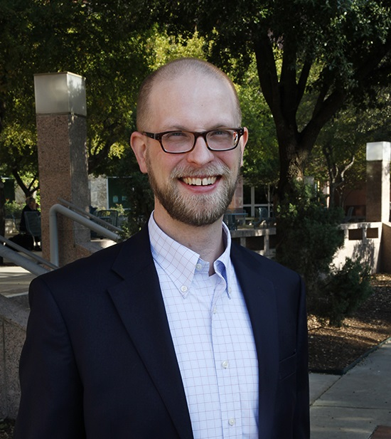

{width=25%, height=25%}

### About Me

I am a Lead Decision Science Analyst at USAA and an associate professor of instruction at the University of Texas at San Antonio. 

My research focuses primarily on spatial and statistical demography. Substantively, I am interested in human health disparities, food security, historical demography and demography of anthropological populations.

My teaching focuses on the use and application of advanced statistical techniques including hierarchical modeling, hazard modeling, multivariate methods and spatial statistics in human population analysis.

